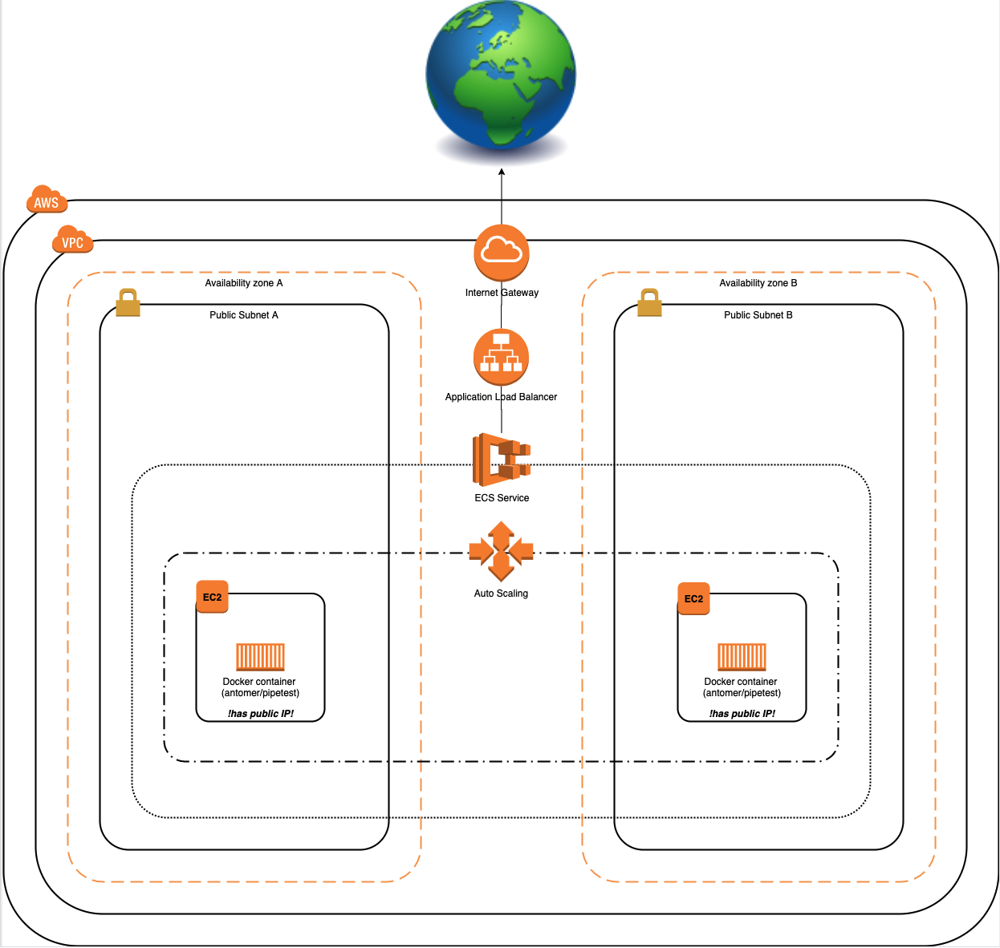

# PIPETEST APP
## 1. Description 
Application is periodically checking for Github users publicly available gists, and creates Deal in Pipedrive CRM for each gist. Application is written in python using Flask framework.

## 2. Build docker image
In order to build a docker image run the following command from the projects root directory

    docker build -t pipetest .

## 3. Configuration
Application configuration is done via environment variables. 
### 3.1 Mandatory environment variable 
* `PIPETEST_PIEPEDRIVE_COMPANY_NAME` - Comapny name in Pipedrive. Default value is set to **antonsawesomecompany**
* `PIPETEST_PIEPEDRIVE_API_KEY` - API key for Pipedrive API (should match `PIPETEST_PIEPEDRIVE_COMPANY_NAME`) 

### 3.2 Optional environment variables (have default value)
* `PIPETEST_QUERIED_USERS` - Comma separated list of GitHub users which will be queried by the app. (ex `PIPETEST_QUERIED_USERS=Kiedis,Flea,Smith,Frusciante`)  Default value set to **antomer**
* `PIPETEST_QUERYING_INTERVAL` - Interval in *minutes* for how often user gists will be fetched from the GitHub.  Default value set to **30**
<em>  !NB As GitHub API has a limit for unauthorized requests. while configuring application it should be considered that amount of queried users * 60 / querying interval should not be more than 60, otherwise, requests will start to fail </em>

## 4. Database
Application is using a local simple database (TinyDB) to store sessions and fetched data. It has two tables: `users`, and `sessions`. Users table stores GitHub username with a list of IDs of publicly available gists. Session table stores unique session_id from the session cookie, and lastly shown gists for a particular session.
   
In order to avoid data duplication in Pipedrive CRM (ex multiple organizations for same user), it is recommended to mount `/db/` folder to the container, otherwise on each run DB will be recreated from scratch.

### 4.1 DB storage in AWS
In AWS setup Amazon Elastic File System is used to store Tiny DB data.

## 5. Run application locally
### 5.1 Get docker image image
1.Build iamge locally/ see step "Build docker image" **OR** Pull latest image from public remote repository 
   
    docker pull antomer/pipetest   
2.Run docker image. Execute command from projects root directory 

    docker run -v ${PWD}:/db PIPETEST_PIEPEDRIVE_COMPANY_NAME=<comapny_name> -e PIPETEST_PIEPEDRIVE_API_KEY=<api_key> -p 8080:8080 -it antomer/pipetest

### Access locally run application
    
    curl localhost:8080/getAllScannedUsers
    
## 6. HTTP endpoints
#### 6.1 Health Endpoint
**Path:** `/health` 
**Allowed methods:** GET 
**Description:** Returns health status of application Used by AWS in order to check if target is healthy.

#### 6.2 Get all scanned users
**Path:** `/getAllScannedUsers` 
**Allowed methods:** GET 
**Description:** Returns all users ever scanned by the app. 

#### 6.3 Get currently scanned users
**Path:** `/getCurrentlyScannedUsers` 
**Allowed methods:** GET 
**Description:** Returns list of users currently being scanned. May differ from `/getAllScannedUsers` response if `PIPETEST_QUERIED_USERS` configuration was changed. 

#### 6.4 Get new gists
**Path:** `/getGists` 
**Allowed methods:** GET 
**Description:** Returns list of new gists for particular session. If session cookie is expired, or not present, then all gists ever fetched by the application will be in the response. 

## 7. Provisioning in the AWS
Application can be provisioned into the AWS cloud using AWS Cloudformation template located in `cloudformation/pipetest.yaml`.  

### 7.1 AWS Setup diagram

### 7.2 CF template parameters
Template requires following parameters as an input:
 * **EnvironmentName (optional)**
    * An environment name that is prefixed to resource names (Default value=development)
 * **VpcCIDR (optional)**
    * CIDR block for VPC (Default value=10.10.0.0/16)
 * **PublicSubnetACIDR (optional)**
    * CIDR block for Public subnet A in VPC. Should be part of VPC CIDR block. (Default value=10.10.10.0/16)
 * **PublicSubnetACIDR (optional)**
    * CIDR block for Public subnet B in VPC. Should be part of VPC CIDR block. (Default value=10.10.11.0/16)
 * **DesiredCapacity (optional)**
    * Number of EC2 and docker instances to be provisioned launch (Default value=1)
 * **PipetestDockerImage (optional)**
    * Dockerimage tag for Pipetest app (Default value=antomer/pipetest)
 * **PipetestQueriedUseres (mandatory)**
    * Comma separated list of users to query from GitHub
 * **PipetestPipedriveCompanyName (mandatory)**
    * Company name in Pipedrive CRM
 * **PipetestPipedriveApiKey (mandatory)**
    * API key for Pipedrive API, should match with PipetestPipedriveCompanyName
    
### 7.3 CF stack outputs
After stack is provisioned in AWS, it will have load balancer's public DNS name in Stack outputs. application will be available via this DNS. 
(Example http://ecsalb-929325745.eu-west-1.elb.amazonaws.com)

### Provisioned resources
Template provisions following AWS resources. All resources are eligible for Free tier:
 * AWS::AutoScaling::AutoScalingGroup
 * AWS::AutoScaling::LaunchConfiguration
 * AWS::EC2::InternetGateway
 * AWS::EC2::Route
 * AWS::EC2::RouteTable
 * AWS::EC2::SecurityGroup
 * AWS::EC2::Subnet
 * AWS::EC2::Subnet
 * AWS::EC2::SubnetRouteTableAssociation
 * AWS::EC2::SubnetRouteTableAssociation
 * AWS::EC2::VPC
 * AWS::EC2::VPCGatewayAttachment
 * AWS::ECS::Cluster
 * AWS::ECS::Service
 * AWS::ECS::TaskDefinition
 * AWS::EFS::FileSystem
 * AWS::EFS::MountTarget
 * AWS::EFS::MountTarget
 * AWS::ElasticLoadBalancingV2::Listener
 * AWS::ElasticLoadBalancingV2::ListenerRule
 * AWS::ElasticLoadBalancingV2::LoadBalancer
 * AWS::ElasticLoadBalancingV2::TargetGroup
 * AWS::IAM::InstanceProfile
 * AWS::IAM::Role

## 8. Possible improvements
* Remove expired sessions from DB
* Check if an organization or deal in Pipedrive exists before creating.
* HTTPS
* Add tests
* And many more..